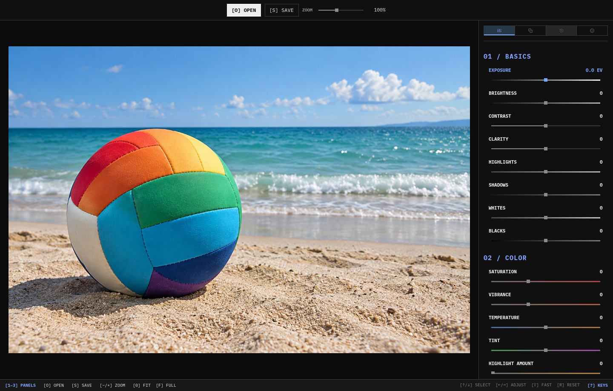

# Omalux

A focused photo editing interface for Omarchy, based on [darktable](https://www.darktable.org/). Our UI, darktable’s image processing.

[omalux.org](https://omalux.org)



*The original Omalux v0 interface; darktable integration is in development.*

## A new direction

We are building on the work of the darktable developers and contributors, whose RAW processing and photography tools make this direction possible. Thank you for making that work available as free software.

We track the official darktable repository as a pinned Git submodule, keep its source unchanged, and will maintain the Omalux Qt/QML interface and adapter separately. Upstream updates will be adopted as complete revisions and tested against our integration.

This is an independent project, not an official darktable edition or an endorsement by its developers. The darktable source and a minimal editing UI are included. Brightness, contrast and saturation are connected directly to darktable’s interactive pixelpipe; the other tools are placeholders. The native prototype keeps a develop context and its caches alive, updates module parameters, and passes preview pixels directly to Qt. There is no new darktable-based release to download yet.

## Repository layout

- [omalux/](omalux/): the Qt/QML interface, native C/C++ adapter and development launcher.
- [darktable/](darktable/): unchanged upstream source, pinned to a stable release by the Git submodule entry.
- [assets/](assets/README.md): the logo and default beach volleyball image.
- [omalux-v0/](omalux-v0/README.md): the original Rust engine, Qt/QML app, CLI, presets, tests and development tools, preserved together.
- [omalux.org/](omalux.org/README.md): the website.

To run the original app:

```sh
cd omalux-v0
cargo run --release -p omalux-gui
```

See the v0 README for dependencies and validation commands. Existing website screenshots show the v0 interface, not a completed darktable integration.

## Upstream and licensing

[darktable](https://github.com/darktable-org/darktable) is free software under GNU GPL version 3 or later; individual components retain their respective notices and licenses. Omalux v0 declares GPL-3.0-or-later in its Cargo manifest.

When distributing a derivative, preserve applicable copyright and license notices, identify changes, and provide the corresponding source under the applicable GPL terms. Upstream authorship stays with its contributors. We intend to keep Omalux-specific work separate and offer generally useful improvements upstream.

## Fetching darktable

For a new checkout:

```sh
git clone --recurse-submodules https://github.com/chriopter/omalux.git
```

For an existing checkout, run from the repository root:

```sh
git submodule update --init --recursive
```

The submodule points directly to the official upstream repository. Keep it at the recorded commit; its nested submodules are pinned by darktable. Updating this source does not install darktable or change the system application.

## Updating darktable

Requires Git and the GitHub CLI (`gh`). Run from the repository root:

```sh
bin/update
git diff --submodule=short
```

The script checks out the latest official stable release and its nested submodules. It stops if darktable has local changes. After trying the new version, pin it with `git add darktable` and commit. The script does not stage, commit or push.

## Development scripts

Run from the repository root:

- `bin/dev [image]` — build and open Omalux with the image; defaults to `assets/images/beach-volleyball.jpg`. `--input image` also works.
- `bin/dev_split [image]` — open Omalux and the original darktable window with the same image. Slider changes and resets in Omalux also update the comparison window. Closing Omalux stops both.
- `bin/update` — check out the latest stable darktable release and its dependencies; review and commit the new pin yourself.

```sh
bin/dev
bin/dev "/path/to/photo.CR3"
bin/dev --input "/path/to/photo.jpg"
bin/dev_split "/path/to/photo.jpg"
```

The UI follows the original dark Omalux layout. **Brightness, contrast and saturation** are active: drag a slider or use Left/Right for the last selected control. Press R to reset all three. Open, save, zoom, presets and the other tools are placeholders. Images are chosen through the launch argument for now.

The launcher builds the C/C++ adapter on demand using `cc`, `c++`, `pkg-config` and Qt 6’s `moc`. It needs Python 3, Git, Qt 6 Quick/Quick Controls, and development headers for GTK 3, JSON-GLib, Little CMS, SQLite, Lua and librsvg. The current Linux build expects Qt tools under `/usr/lib/qt6/` and an installed release build of darktable 5.6.0 or 5.6.1. It does not build the darktable submodule itself.

The build extracts the **matching installed release’s headers** into ignored `omalux/build/` (fetching its official tag if needed); it never changes the submodule checkout. Override `DARKTABLE_LIBRARY`, `DARKTABLE_BIN`, `DARKTABLE_MODULEDIR` and `DARKTABLE_DATADIR` for another matching installation. Unsupported versions are rejected until the adapter has been reviewed for their internal ABI.

The engine runs inside the Qt application on a dedicated worker thread. It keeps the develop context, decoded image cache and pixelpipe alive; slider changes update darktable’s `colisa` module using its internal parameter introspection. Only the newest requested value is queued, and obsolete frames are discarded. Preview buffers are copied directly into QImage, without XMP reloads, image export or JPEG encoding. The preview fits within 1400 × 1000 pixels and uses darktable’s automatic OpenCL selection, with CPU fallback. A visible warning reports unavailable or failed GPU acceleration. Viewport-dependent resolution is a later step.

For AMD GPUs using Mesa Rusticl, install `opencl-mesa`; the dev launcher defaults `RUSTICL_ENABLE` to `radeonsi` unless you override it. The UI status “OpenCL auto” indicates automatic device selection, not that every module ran on the GPU.

Each launch uses temporary config, cache and database directories, with source sidecar writes disabled. Edits are not saved when the session closes. Both scripts open their windows on your current workspace.

Split mode runs two independent engines with separate databases. Omalux publishes the latest complete control state to an atomic session file; `omalux/comparison.lua` polls it every 50 ms and applies it through darktable’s GUI actions when the darkroom is open. Omalux never waits for the comparison render. Synchronization is one-way and currently covers brightness, contrast and saturation; changes made in darktable do not flow back. Two engines consume additional RAM/GPU resources and can compete for processing time. The comparison installation needs Lua support; bridge failures are logged in the launching terminal.

### Adding a slider

Add one row to [`omalux/native/controls.h`](omalux/native/controls.h): ID, label, darktable module and float parameter name, UI minimum/maximum/step/default, and scale/offset (`parameter = UI value × scale + offset`). The QML sliders, native parameter lookup and split-mode messages all use this definition; no new Qt property or Lua mapping is needed. Verify the parameter type/range and GUI action in the matching darktable source first. This adapter currently supports float parameters with matching slider actions, not arbitrary module controls.

`editor.setControl(id, value)` queues a complete parameter snapshot. The engine applies it before rendering and updates history once per affected module. The split bridge receives the same converted values, including unchanged controls, so skipping intermediate snapshots does not lose edits to other sliders.
