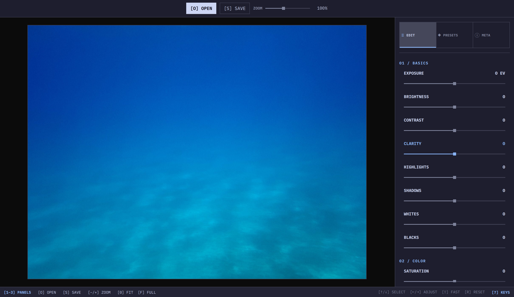

# Omalux



> **Status:** In development; UI and presets are being polished.

A focused photo developer for Omarchy. The workspace separates a Qt-free Rust
processing core/CLI from the CXX-Qt and Qt Quick desktop application.

The default core build has no HEIC dependency. Optional production HEIC export
uses the dynamic system libheif and its x265 encoder; the desktop GUI enables
that feature by default because HEIC is offered in its export dialog:

```bash
cargo build --features heic
```

Arch/Omarchy packaging must provide compatible `libheif` and `x265`
development/runtime files. See [`docs/io-heic-encode.md`](docs/io-heic-encode.md)
for capability, resource, cancellation, licensing, and HEVC legal constraints.

Implementation boundaries and directory responsibilities are documented in
[`docs/architecture.md`](docs/architecture.md). The film-grain implementation
and licensing provenance live in [`docs/grain-model.md`](docs/grain-model.md).

## Features

- Open JPEG, PNG, BMP and common camera RAW files
- Decode raster and full-resolution RAW sources through the bounded production decoder
- Render previews and exports through the same CPU development pipeline
- Follow the active Omarchy color theme live, including theme switches while running
- Switch between Edit, Presets, and real file/EXIF metadata panels in a compact tool grid
- Edit groups all controls under Basics, Color, and Effects; Grain remains live, with Size and Midtones in a collapsible advanced section
- Select presets from the validated core preset catalog
- Save the unchanged original or export JPEG/HEIC at adjustable quality, with resolution and size estimates
- Zoom from 25% to 800% with the mouse wheel or touchpad pinch, and pan enlarged photographs
- Navigate the TUI-inspired develop panel with J/K or arrows, adjust with H/L, and press `?` for the complete keyboard reference
- Use the GPL-compatible darktable/RawTherapee three-octave grain and photographic-paper response model

## Reference pictures

Fixed inputs for visual checks of presets and pipeline changes live in
[`reference pictures/`](reference%20pictures/). The beach photograph is AI-generated;
the technical charts are computed from known values. Real photographs and RAW
files can be added to `reference pictures/real pics/`, which is currently empty.

<details>
<summary>Show reference gallery — beach photograph and six technical charts</summary>

### Overall scene

The colored volleyball, sand, sea, clouds, and shadow provide a quick check of
overall color, texture, highlights, and shadows. This is a fixed visual input,
not a calibrated color reference.


### Grayscale

A continuous black-to-white ramp above 32 discrete gray levels.


### Shadows and highlights

Smooth and stepped ramps in the darkest 8% and brightest 8% of encoded sRGB.
Use these to inspect detail loss, clipping, and tonal discontinuities.


### Color channels

Red, green, blue, cyan, magenta, and yellow; each pair runs from black to the
color and then from the color to white.


### Hue and saturation

Hue runs horizontally and saturation increases downward within each band.
The three bands use HSV values of 1, 0.5, and 0.125; these are encoded RGB
values, not equal perceptual lightness.


### Known color patches

Four rows of neutrals, saturated colors, pastels, and earthy colors. Exact RGB
triplets are recorded in the technical manifest. This is a synthetic chart,
not a measured ColorChecker.


### Edges, fine detail, and noise

Top row: vertical edge, slanted edge, and bars with widths from 1 to 32 pixels.
Bottom row: checkerboard, uniform gray, and fixed monochrome noise. Inspect at
100% zoom; the README's scaled preview can introduce moiré or hide fine detail.


</details>

Regenerate the six lossless 16-bit sRGB PNGs with Python 3, with no extra packages:

```bash
python3 "reference pictures/technical/generate.py"
```

[`technical/manifest.json`](reference%20pictures/technical/manifest.json) records
dimensions, values, and hashes. These are display-referred fixtures; they do not
exercise RAW decoding or scene-linear values above white. The generation prompt
and asset notes are in [`reference pictures/README.md`](reference%20pictures/README.md).

The gallery supplies inputs, not an automated regression suite. For update
comparisons, keep inputs, presets, settings, and random seeds fixed, then compare
decoded output pixels against reviewed reference exports. Review intentional
changes before replacing those references.

## Keyboard

- `1`–`3`: open Edit, Presets, or Metadata; `Tab` and `[`/`]` cycle panels
- `J`/`K` or `Down`/`Up`: select a parameter
- `H`/`L` or `Left`/`Right`: adjust it; hold `Shift` for larger steps
- `G`, `S`, `M`: jump to Grain, Size, or Midtones
- `A`: expand or collapse the Grain subparameters
- `R`: reset the selected parameter
- `-`/`+`: zoom; `0`: fit; `F`: image-only fullscreen (any key exits); `O`: open; `?` or `F1`: keyboard reference
- `Ctrl+S`: choose Original, JPEG, or HEIC export
- Standard `Ctrl+O`, `Ctrl+-`, `Ctrl++`, and `Ctrl+0` shortcuts remain available

## Command line

Open a photograph directly:

```bash
omalux-gui --input ~/Pictures/photo.jpg
```

Run the same CPU development and HEIC export path without dialogs:

```bash
omalux-gui --headless \
  --input ~/Pictures/photo.jpg \
  --output /tmp/photo-omalux.heic \
  --format heic \
  --quality 90 \
  --grain 24 \
  --grain-size 4000 \
  --midtones 100
```

The GUI command's `--format` accepts `original`, `jpg`/`jpeg`, and
`heic`/`heif`. The process
returns a non-zero exit status when decoding, developing, or encoding fails.

After building, run the automated end-to-end export check with:

```bash
scripts/smoke-cli-export.sh ~/Downloads/example.jpg
```

The Qt-free core executable exposes machine-testable catalog, parameter, and
backend commands without loading Qt:

```bash
omalux --help
omalux presets list --json
omalux presets show neutral --json
omalux parameters list --json
omalux probe --json
```

Launch the separately packaged desktop sibling explicitly with
`omalux gui [--input PATH]`. The core resolves `omalux-gui` beside its own
executable and never searches `PATH` for it. Linux launch holds and verifies
the regular sibling without following symlinks before executing the held file.

Run a real bounded, color-managed development job through the Qt-free
core. The decoder opens the source once, output defaults to no-overwrite atomic
publication, quality defaults to 90, and progress is written to stderr:

```bash
omalux develop --input photo.jpg --output result.jpg \
  --preset neutral --set basics.brightness=12 --quality 90 --progress human
```

JPEG, PNG, BMP, and supported camera RAW inputs are accepted. The default build
exports JPEG and rejects HEIC before requested-file I/O; `--features heic` adds
10-bit libheif/x265 HEIC export with the same atomic publication contract. Estimator-
approved composable PointwiseV1, ColorV1, SpatialV1, GeometryV1, and
RadialMasksV1 presets and `--set` overrides run in production. Unsupported
settings such as negative local sharpness remain fail-closed before development
or output publication.
Use `--json` for the path-free final report and `--progress json` for path-free
stage events on stderr. SIGINT cancels with exit 130. See
[`docs/cli.md`](docs/cli.md) for flags, resource limits, exit codes, metadata and
alpha policy, and the `published_but_not_durable` commit-point contract.

## Requirements

Core and CLI:

- Rust
- Little CMS 2
- LibRaw (`dcraw_emu` is used by RAW decoding)

Desktop GUI additionally requires:

- Qt 6 with Qt Quick and Qt Quick Controls
- ImageMagick (`magick identify` supplements the metadata panel)
- A C++ compiler

## Run

```bash
cargo run --release -p omalux-gui
```

Build or test the Qt-free core alone with `cargo build -p omalux` and
`cargo test -p omalux`. The GUI embeds QML only; photo decoding,
development, and encoding remain in the shared Rust core.

The GUI has no repeating idle timers. Its Omarchy theme integration uses one
Qt event-loop filesystem watcher, and completed preview workers terminate
instead of polling. Measure an optimized no-photo idle window with:

```bash
cargo build --release -p omalux-gui
scripts/benchmark-gui-idle.sh
```

The benchmark settles for 10 seconds, samples for 30 seconds, rejects retained
child processes, and requires average process CPU below 1% of one core. Pass an
already-supported public test image with `--input PATH` to measure the settled
post-preview state; `--platform wayland` exercises an on-screen window.

## Install and package

Install both executables from a checkout with matching package versions:

```bash
cargo install --path . --locked
cargo install --path crates/omalux-gui --locked
```

The first command installs the Qt-free `omalux` core/CLI; the second installs
the `omalux-gui` desktop application and therefore requires Qt. Install and
validate the desktop entry separately, for example for the current user:

```bash
install -Dm644 packaging/arch/omalux.desktop \
  ~/.local/share/applications/omalux.desktop
desktop-file-validate ~/.local/share/applications/omalux.desktop
```

Distribution packages must ship both binaries in the executable search path
and install `packaging/arch/omalux.desktop` under
`share/applications/omalux.desktop`. The desktop entry passes one selected
photo to `omalux-gui` through `%f`.

Before publishing source packages, validate both Cargo package manifests and
their included files:

```bash
cargo package --allow-dirty --workspace
```

The GUI dependency pins the exact matching `omalux` core version while also
retaining its workspace path for local builds. Packaging the workspace together
lets Cargo build and fully verify both archives against its temporary local
registry before either package has been published. Release the core package
before the GUI package so the same exact dependency can be resolved by the
target registry.
