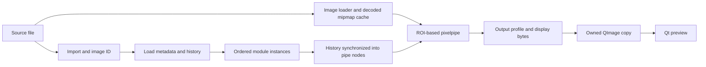

# darktable internals for Omalux

Source audit: 2026-09-08. Main reference: the pinned `release-5.6.1` submodule (`03179f8e080aa9cedebfe14b098b7ba88940a292`). Our installed adapter currently targets 5.6.0; the cache-disabling and OpenCL-error-reset findings below were also checked in its extracted source. Line numbers refer to 5.6.1 unless stated otherwise. Recheck symbols after an upstream update.

This is a source-grounded integration map, not a claim that every module has been audited or that performance parity has been measured. Claude Code was used for a focused independent review of the critical cache/GPU/control excerpts; its findings and rejected hypotheses are recorded in [the source cross-check](source-review.md). A broader Claude investigation was also attempted but had not produced a report when the focused review completed. The original audit was source-only; the interactive-preview update and measurements below record subsequent implementation work.

## Read this first

1. **The interactive preview now retains darktable’s cached FULL pipe.** The earlier `IMAGE` helper flag disabled intermediate cache reuse; see the performance update below.
2. **The three working sliders use a deprecated, display-referred Lab module.** `colisa` is convenient for proving the adapter, not the intended foundation for modern RAW adjustments.
3. **Our GPU warning misses some real fallbacks.** darktable clears `opencl_error` while restarting the pipe on CPU; enabled, running, selected and actually used are different states.
4. **A control is more than a float pointer.** Module instance, type, range, workflow, history, masks, GUI action identity and persistence all matter when extending the registry.
5. **One authoritative develop state remains the right direction.** Keep the second full darktable process as an optional development comparison, not production state ownership.

## Source map

Paths are relative to the darktable submodule.

| Area | Entry points | Why Omalux needs it |
| --- | --- | --- |
| Process startup/shutdown | [`src/common/darktable.c`](../../darktable/src/common/darktable.c): `dt_init`, `dt_cleanup` | Global configuration, databases, modules, caches, OpenCL, signals and lifecycle |
| Develop state | [`src/develop/develop.h`](../../darktable/src/develop/develop.h): `dt_develop_t`, `dt_dev_viewport_t` | Image, module instances, history, viewports and pipe ownership |
| Rendering coordinator | [`src/develop/develop.c`](../../darktable/src/develop/develop.c): `dt_dev_process_image_job` (597), `dt_dev_image` (near 3930) | Input loading, node synchronization, ROI, restart and publication |
| Pixel processing | [`src/develop/pixelpipe_hb.c`](../../darktable/src/develop/pixelpipe_hb.c): `dt_dev_pixelpipe_process` (3147) | Recursive module processing, GPU/CPU, caching and output |
| Cache | [`src/develop/pixelpipe_cache.c`](../../darktable/src/develop/pixelpipe_cache.c): basic hash (103), availability (178) | Reuse is keyed by image, pipe, profiles, upstream state and ROI |
| Module contract | [`src/iop/iop_api.h`](../../darktable/src/iop/iop_api.h), [`src/develop/imageop.h`](../../darktable/src/develop/imageop.h) | Parameters, introspection, processing callbacks, instances |
| Processing order | [`src/common/iop_order.c`](../../darktable/src/common/iop_order.c) | Workflow/image-dependent order, not sidebar order |
| Input/decoder dispatch | [`src/imageio/imageio.c`](../../darktable/src/imageio/imageio.c): `dt_imageio_open` (1626) | Signature dispatch and decoder fallbacks |
| Import and persistence | [`src/common/image.c`](../../darktable/src/common/image.c), [`src/develop/develop.c`](../../darktable/src/develop/develop.c) | Image IDs, sidecars, history and database |
| Input/output color | [`src/iop/colorin.c`](../../darktable/src/iop/colorin.c), [`src/iop/colorout.c`](../../darktable/src/iop/colorout.c), [`src/iop/gamma.c`](../../darktable/src/iop/gamma.c) | Camera/working/display profiles and display byte layout |
| OpenCL | [`src/common/opencl.c`](../../darktable/src/common/opencl.c): `dt_opencl_lock_device` (2041), enabled/running checks (3727) | Device policy and runtime state |
| GTK darkroom | [`src/views/darkroom.c`](../../darktable/src/views/darkroom.c), [`src/bauhaus/bauhaus.c`](../../darktable/src/bauhaus/bauhaus.c) | View scheduling, module widgets and actions |
| Lua bridge | [`src/lua/gui.c`](../../darktable/src/lua/gui.c): `_action_cb` (109), registration (428); [`src/lua/call.c`](../../darktable/src/lua/call.c): GTK wrapper (635) | Safe dispatch of comparison actions to GTK |
| Export | [`src/imageio/imageio.c`](../../darktable/src/imageio/imageio.c): `dt_imageio_export_with_flags` (1045) | Independent full-resolution pipe, output formats and metadata |

## 1. Lifecycle and ownership

`dt_init(..., FALSE, TRUE, ...)` avoids initializing the GTK frontend but does not create a small isolated image-processing object. darktable has a process-global `darktable` state. Startup initializes databases, control infrastructure, profiles, module shared objects and other services. It even allocates `darktable.develop` (`darktable.c:1938`) in addition to the local develop context our adapter creates. Undo setup is gated by `init_gui` (`darktable.c:1758`).

Our actual production-mode prototype is **Qt plus libdarktable in one process, with an Omalux worker thread**. It is not a separately supervised engine process. Split mode adds an independent GTK darktable process. Upstream builds a shared `lib_darktable` and links its executable to it (`src/CMakeLists.txt:1015,1116`), but that library includes application/UI infrastructure; it is not a separately maintained minimal RAW SDK. That distinction matters for crash isolation and memory ownership.

The sequence `dt_dev_init(&dev, TRUE); dev.gui_attached = FALSE` initially looks contradictory, but matches upstream `dt_dev_image`: TRUE allocates full/preview/preview2 pipes and histograms (`develop.c:95`); subsequent FALSE suppresses normal GUI behavior. Do not simplify this to `dt_dev_init(FALSE)` while retaining the same full-pipe code: those pipes would not exist. `dt_dev_load_image` also assumes all three exist when full.pipe is present (`develop.c:1000`).

Keep Omalux parameter edits, image switching and rendering serialized on the owning worker. Module/parameter pointers belong to the current develop context and must be rebound after image load, history reload or instance replacement. Stop all consumers before `dt_dev_cleanup`; clear loaded/pointer state after cleanup and cover initialization failures. Upstream cleanup releases pipes, module instances, history, masks and profile data (`develop.c:197`).

## 2. From source file to pixels



`dt_image_import` creates/loads catalogue state; it is not the actual RAW development step. `dt_dev_load_image` loads module instances and history. `dt_dev_process_image_job` obtains decoded pixels through the mipmap cache, with FULL/BLOCKING input when a viewport is provided, and F/BEST_EFFORT for the preview path (`develop.c:630`). Decoding and demosaicing are distinct responsibilities: RAW decoding supplies sensor data; processing modules handle the development operations.

`dt_imageio_open` first uses file-signature dispatch and then fallbacks including RawSpeed, LibRaw and exotic loaders as applicable (`imageio.c:1626`). The wrapper was reviewed here; this is not an audit of the bundled decoders themselves.

The job coordinator owns pipe locking, node creation/synchronization, viewport scale/ROI, restarts and final status. A render job returns `void`. Some early returns retain previously allocated buffers while marking the pipe dirty/invalid. The adapter now requires VALID pipe status as well as a non-null, positive-sized buffer. The worker guards publication with a presentation epoch and monotonic render revisions.

## 3. Performance: interactive preview update

Confirmed call chain:

- The original Omalux adapter set `dev.full.pipe->type |= DT_DEV_PIXELPIPE_IMAGE` in `native/engine/engine.c`.
- `dt_dev_pixelpipe_process` sets `pipe->nocache = dt_pipe_is_image(pipe)` (`pixelpipe_hb.c:3157`; 5.6.0:3064).
- Recursive processing only uses cached results when `!pipe->nocache` (`pixelpipe_hb.c:1827`). Cache availability independently rejects nocache (`pixelpipe_cache.c:178`).

The flag came from the upstream helper for producing an image, not from a guarantee of optimal persistent interactive rendering. Our warm-process advantage and decoded-input cache remain distinct from intermediate stage reuse. Correct the assumption that keeping pipe allocations alive automatically means earlier stages are reused.

The adapter now retains the FULL pipe initialized by `dt_dev_init`, with its normal cache allocation and history-driven invalidation. The source review covered IMAGE flag uses in both installed 5.6.0 and pinned 5.6.1: finalscale still recognizes FULL through CANVAS; IMAGE_FINAL was never set; hazeremoval’s IMAGE check only emits a warning when preview-derived estimates are unavailable; the zoom-only fast return in develop is not used by scalar edits. GTK-dependent work stays disabled through `gui_attached = FALSE`. We do not change upstream or enable GTK callbacks.

The worker still serializes engine edits and coalesces pending slider values, but now publishes completed intermediate frames while newer scalar values are pending. It never writes old control values back over new input. A separate presentation epoch advances for image changes, presets, history and other session actions; completed frames from an earlier epoch are rejected both before queuing and on the Qt thread. Published render revisions are monotonic. This prevents starvation during continuous dragging without displaying an old image across a session action. In-flight rendering is not cancelled.

`OMALUX_FLUSH_PREVIEW_CACHE=1` is an opt-in diagnostic: flush the intermediate cache immediately before each render, retaining the same FULL pipe, backend and ROI. Normal runs reuse eligible stages. Dirty-control revisions restrict history updates to changed modules.

Measured on this workstation with the shared beach JPEG, OpenCL enabled, fixed 1400 × 1000 fit viewport and private sessions:

- 16 scalar updates across brightness, exposure and temperature: median render-plus-QImage-copy time **27.5 ms cached**, **36.5 ms forced recompute**. Cold startup excluded; first module activations included. This is not input-to-screen latency.
- 15 distinct output images matched pixel-for-pixel against both the previous IMAGE path and forced recomputation (ImageMagick AE = 0).
- Split-mode continuous brightness drag, 180 samples at a nominal 16 ms interval: **83 intermediate preview revisions** observed during the drag; final control value reached 0.3. These are published preview updates, not measured compositor frames.
- Preset replacement and history restoration are exercised separately. No claim of parity across arbitrary RAWs, profiles, expensive modules or GPUs follows from this JPEG test.

Run the persistent-engine regression with:

```sh
QT_FORCE_STDERR_LOGGING=1 OMALUX_SMOKE_SCRIPT="$PWD/omalux/tests/interactive-preview.json" dev/start_split
```

It uses a private session, checks updates during sustained input, verifies final values, restores history and reapplies a preset after edits. Use `QT_QPA_PLATFORM=offscreen` for the Qt window when running unattended; the optional GTK twin still requires desktop access. Large RAW latency, memory pressure and cancellation remain follow-up performance work.

## 4. Parameters, instances and history

A module shared object describes an operation; a `dt_iop_module_t` is a develop-context instance; pipe nodes hold committed processing state. `params` is editable state, not a universal instruction to redraw. `get_p` provides a field address, while `get_f` and the introspection metadata supply field type/range (`iop_api.h:314`, `common/introspection.h:57`).

Our registry only supports known floats and an affine UI-to-parameter transform. Before widening it:

- Validate introspection presence, field type, range and transformed bounds; fail with the control ID rather than casting arbitrary fields to `float *`.
- Identify a specific module instance, not merely the first operation-name match. `multi_priority`, operation and module order are part of identity.
- Read loaded values/enabled state into UI. The preset-catalogue implementation now reads imported values at startup and preserves module enabled state until an explicit control edit.
- Separate native parameter identity from the GTK action path. Widget labels/sections may differ from C field names. `iop/module/parameter` works for colisa but is not a universal action naming rule. `develop/imageop_gui.c:66–149` derives labels from introspection descriptions or replaces underscores with spaces; `bauhaus/bauhaus.c:1052` defines actions from those labels and sections.
- Keep complete snapshots to avoid losing edits when coalescing. Track dirty modules within the worker for history/synchronization efficiency.

`dt_dev_add_history_item_ext` updates module history and marks pipes for SYNCH or TOP_CHANGED (`develop.c:1180–1349`). The regular GUI wrapper adds undo grouping, timestamps/tags, invalidation and signals and exits early when `darktable.gui` is absent (`develop.c:1371`). The ext call is appropriate for our current controlled headless path, but is not equivalent to a complete user edit transaction.

Repeated changes to the same top history item can merge. History is the processing recipe; it is not automatically a complete UI undo stack. Reset-all currently means writing registry defaults and enabling the controlled modules, not restoring the image's imported recipe. Specify separate semantics for reset control, reset image and undo.

Masks and blending have their own history/state. Multi-instance modules, forms and raster-mask dependencies need deliberate support; copying just numeric slider values is insufficient.

## 5. Color and camera profiles

The pipeline does not have one universal color space or a fixed order matching our sidebar. Use the workflow and order stored with the image (`common/iop_order.c`), and let modules declare input/output spaces and ROI transforms. RGB RAW and JPEG workflows differ.

`colorin.reload_defaults` selects profiles from image metadata and capabilities. Its fallback chain includes embedded profiles, recognized image color spaces, embedded matrices and supported camera matrices (`colorin.c:1892`). Users normally need not choose their camera manually. This source finding does not imply Adobe DCP look-table compatibility or Lightroom preset equivalence.

Our `colisa` module explicitly advertises non-linear Lab/display-referred processing and deprecation (`colisa.c:74–108`); upstream points to color balance RGB. For the next deliberate UI mapping, investigate:

| UI intent | Candidate module/parameter | Caveat |
| --- | --- | --- |
| Exposure in EV | `exposure.exposure` | Not the same operation or unit as colisa brightness |
| Scene grading contrast | `colorbalancergb.contrast` | Has a contrast fulcrum and different visual behavior |
| Saturation/colorfulness | `colorbalancergb.saturation_global` or `chroma_global` | Perceptual saturation and chroma are different controls; choose by image tests |
| Scene-to-display tone mapping | Workflow-selected `filmicrgb`, `sigmoid` or `agx` | Do not enable all or treat them as interchangeable presets |

These are source-derived candidates, not drop-in replacements with identical results. Preserve imported workflows and test RAW highlights, skin, saturated colors and monochrome images.

`colorout.commit_params` chooses output profiles by pipe purpose: export overrides, thumbnail colorspace, second-display profile, or main display profile (`colorout.c:554–619`). Omalux must explicitly own the display color contract, including monitor changes and any Qt/compositor transform. The current untagged QImage route does not establish color parity with the GTK window merely because both use darktable.

The `gamma` display module's normal `_copy_output` writes BGR channels and leaves the fourth byte untouched (`gamma.c:265`). Our alpha fill is required for QImage RGB32 on the current platform. Retain it; do not infer transparency from the unused byte or use this 8-bit display buffer as the export source.

## 6. GPU status and failure semantics

`dt_opencl_is_enabled` only checks initialized plus enabled (`opencl.c:3727`). Runtime state is exposed separately by `dt_opencl_running`; device selection depends on pipe class and configured priorities (`opencl.c:2041`). Individual modules may process on CPU, GPU or tiled paths.

On OpenCL failure, the pixelpipe releases resources, sets `opencl_enabled = FALSE`, **clears `opencl_error`**, increments the global error counter and restarts on CPU (`pixelpipe_hb.c:3243–3284`). It can eventually stop OpenCL for the session. The normal completion path also resets `pipe->devid` to CPU after releasing the device (`3294`), so reading the final device ID is not a reliable replacement.

Our warning should distinguish configuration unavailable, runtime stopped, per-render fallback and normal mixed processing. A narrow telemetry hook or an adapter-visible render result is preferable to guessing from transient flags. This audit confirms a reporting gap, not a new failure of the user's GPU.

## 7. Split-mode comparison

The private atomic mailbox transports a complete latest control state; Lua polls every 50 ms. `dt.gui.action` is explicitly GTK-wrapped (`lua/gui.c:428`); the wrapper dispatches through GLib and waits for completion (`lua/call.c:648`). This is preferable to writing GTK module structures from the polling thread. Omalux itself does not wait for the second process.

However, several GUI actions are separate edit operations, not one atomic multi-module transaction. Intermediate comparison frames may appear. The two instances also have independent module state, histories, caches and display configuration. Do not call this a pixel-equality validator.

Before more complex comparisons, align workflow, module instance, enabled state, profiles, processing resolution and source history. The default action instance can follow GTK focus/expanded/enabled preferences (`develop/imageop.c:3680–3736`), while Omalux selects the first matching operation. Confirm image identity before applying commands; our current bridge checks darkroom view but does not stop edits being applied to a different image opened in that window. Add an acknowledgement/revision for stale or failed comparison state if it is used for validation. Native parameter names and GUI action paths must be modeled separately when they diverge.

## 8. Saving, sidecars and export

Image identity, metadata, processing history, presets/styles and user configuration are separate persistent concerns. Startup/history loading can apply defaults and matching auto-presets (`develop.c:1856`, `2301`). Existing XMP sidecars may be read during import (`common/image.c:1794`, `2050`); `write_sidecar_files=never` prevents writes, not reads.

`dt_dev_write_history_ext` writes develop history to the image's database state (`develop.c:1769`); wrapper behavior and sidecar policy must be understood before adding Save. Our temporary databases are prototype behavior, not a persistence design.

`dt_imageio_export_with_flags` creates its own develop context, loads image/history and initializes an export pipe (`imageio.c:1045–1127`). A future export based only on image ID can miss our unsaved in-memory edits. First snapshot/persist the intended processing recipe into a controlled context, then use the export pipeline with explicit profile, dimensions, format, bit depth and metadata policy. Do not save the QImage preview as the developed original.

## 9. Recommended implementation order

1. Define structured render results: revision/image identity, valid/failed/cancelled status, dimensions, output color contract and GPU telemetry.
2. Establish interactive caching and dirty-module tracking, validated against the existing rendering path before benchmarking.
3. Harden control resolution: introspection types, explicit instances, imported state, action paths and reset semantics.
4. Introduce deliberate scene-referred controls while preserving stored workflows.
5. Add viewport/zoom and image-switch lifetime handling; implement cancellation only with a verified locking contract.
6. Add persistent history/undo and export from the same authoritative recipe.
7. Extend comparison to acknowledge recipes and use reference images under controlled color/scale settings.

Keep the official submodule unchanged while this can be done in the adapter. If a real missing hook requires source changes, keep a small versioned overlay with a clear invariant and upstream rationale. Do not claim the installed libdarktable is a stable SDK: patch releases here already change pixelpipe/cache structures. The current exact-header check is necessary but does not by itself validate distributor patches, plugin ABI or behavior changes. For reproducible distribution, build the library, plugins and data from one pinned revision with recorded build options instead of coupling a source submodule to an independently updated system installation.

## Verification still needed

This source audit does not settle monitor color management on this Wayland/Qt setup, performance parity, cancellation races, complex imported XMP/masks, export equivalence or decoder support across cameras. Those need focused runtime experiments and representative RAW files. Revisit this document after each implementation change; the original audit targets commit `30f421a`; the preset integration section records subsequent changes.

## Targeted regression experiments for the next changes

| Experiment | Required observation |
| --- | --- |
| Re-render after changing only a late control | Earlier eligible stages hit cache; output agrees with a forced recompute using the same backend/profile/ROI |
| Change two controls in different modules while rendering | Latest frame contains both edits; unchanged modules do not accumulate history entries |
| Undo, then edit | Future history is discarded intentionally, with no dangling module/mask references |
| Import XMP containing enabled/disabled and duplicate instances | UI reflects the selected instance's loaded values; opening alone does not overwrite the recipe |
| Apply comparison edits after changing GTK focus or image | Correct explicit instance receives them, or the bridge rejects the mismatched image |
| Switch image while a render is pending | No old image/frame is published under the new image identity |
| Force a render/load failure after one successful frame | Prior pixels are not reported as a newly successful render |
| Exercise CPU fallback in a controlled test build | CPU result is usable and the fallback is reported even after transient error flags are cleared |
| Change display/profile and move/resize viewport | Correct color transform and pixel dimensions are applied once, with valid cache invalidation |
| Export immediately after editing | Full-resolution output uses the current recipe, not a stale database history or the preview buffer |

Use deterministic fixtures where possible, retain backend/profile/ROI metadata with results, and separate cold-start compilation/decoding from warm interactive timing. Do not run these all as boilerplate for documentation edits; they are gates for the corresponding future engine changes.

## Preset catalogue integration

`native/app/presets.cpp` discovers `.dtstyle` files recursively under `presets/`, using relative paths as IDs and sibling `thumbnail.jpg` files for compact preview rows. `native/engine/style_details.c` imports them into the private session database, checks module versions/sizes and decodes settings through darktable introspection. The UI is a generic expandable inspector; application is not limited by the three-control registry. Unsupported files remain visible with an error. Custom ordering and drawn-mask records are currently rejected. Old parameter layouts are not migrated.

Style application preflights every item, restores the per-image opening baseline, applies items through `dt_styles_apply_style_item`, rebinds controls and reads values back. Rendering no longer writes control snapshots indiscriminately: per-control revisions select changed parameters. This fixes the earlier startup-default overwrite and unintended re-enabling of modules during a style render. It does not resolve ambiguous duplicate-instance selection.

The v3 comparison mailbox keeps style events with the preceding control snapshot (including pending edits flushed before application), plus the newest control snapshot. Style epochs and per-control revisions prevent unchanged values from overwriting style settings and let the bridge replay multiple style boundaries in order. Only the filename/name identifies a style; both processes use the same catalogue directory. The bridge imports styles into its private database and applies them with `dt.styles.apply`. Files are a startup snapshot and should not be edited while comparing a session. Synchronization remains one-way.

## Expanded UI adapter (2026-09-08)

The original three-control audit above describes the starting prototype. The current registry now covers the [v0 mapping](../reference/controls.md), including typed special controls. The GPU caveats above still apply; the cache and frame-publication update is described in section 3.

`controls.h` separates display labels/units, native parameters and GTK action paths. Native binding selects `multi_priority == 0` deliberately and validates float type, size and hard range. Integer fields, enablement and blend opacity have explicit bindings. Denoise curves validate the 6 × 7 ordinate array. `native/engine/white_balance.c` adapts the installed darktable temperature module's spectral/XYZ math and camera matrices to convert temperature/tint into white-balance coefficients; this is not a new color-temperature algorithm.

`native/engine/metadata.c`, `style_snapshot.c` and `export.c` own metadata, compatible style snapshots and full-resolution export respectively. It serializes parameters using darktable's XMP encoder and packages local LUT assets for saved presets. Private single-module snapshots preserve existing LUT paths. JPEG/PNG export writes the worker's develop history to its temporary database and calls `dt_imageio_export`; source sidecars remain disabled. The resulting output is copied atomically to the user-selected destination.

The worker serializes all engine actions. Mailbox v3 includes the current image source, scalar revisions, style boundaries and module snapshots. Lua uses GUI actions for scalar changes and imports private module styles for curves/blend recipes. The comparison process remains independent and receives one-way edits. This is a development aid, not shared engine state or a performance guarantee.


## History display

`native/engine/history.c` copies the worker-owned `dev.history` into a JSON list, newest first. Labels use `dt_history_get_name_label`, as `src/libs/history.c` does; the active prefix/current row comes from `dev.history_end`. The matching 5.6.0 headers and pinned 5.6.1 source were checked for the history-item layout. The list includes imported and automatic steps, module enablement, and preset modules without Omalux controls. It follows darktable’s merging of adjacent module edits, rather than logging every slider event.

Qt receives copied data through a queued signal; `panels/HistoryPanel.qml` displays it and emits a selected step. Reading the stack neither changes engine history nor sends comparison commands. The next worker update after opening another photo replaces the list with that photo’s history. Restoration runs on the owning worker via `dt_dev_pop_history_items_ext`, followed by a pipe rebuild, invalidation and control rebinding. It preserves the future stack until darktable truncates it on the next edit. A synthetic original row selects history position zero. Dedicated undo/redo shortcuts are not implemented.

In split mode, a history jump writes the selected module state as a private style snapshot. This includes modules in the registry and history, including disabled modules, and preserves LUT paths. Lua applies that snapshot before subsequent controls. It synchronizes the rendering state rather than matching history row numbers between the independent engines. Snapshot compatibility limits (masks and extra module instances) still apply. The source image’s sidecar is not written. Export and preset saving use the selected state.


## Preset replacement baseline

`native/engine/preset_baseline.c` owns copies of every loaded module’s parameters, blend settings and enabled state. The baseline is captured after image loading, cleared before develop cleanup, and recaptured for the next image. It preserves the loaded camera/workflow configuration and any opening sidecar edits. It is not built from fixed UI reset values.

After preset compatibility checks, changed modules are restored to this baseline with native history entries before the new style is applied. Thus earlier session changes to unrelated modules do not carry into the look, while history can still reach the previous edits. Preset application and history jumps both send a complete private style snapshot to the comparison process; sending only the newly selected style would leave stale comparison modules enabled. Existing snapshot limitations still apply.

## Adaptive slider previews

Qt sliders explicitly use `live: true` and pass their pressed state through component signals to `Editor::setInteractive`. During a gesture the same FULL pipe renders a 700 × 500 fit viewport; release requests a 1400 × 1000 fit render even when the last value did not change. The release advances the presentation epoch so an in-flight reduced frame cannot replace the final image. Viewport changes set `DT_DEV_PIPE_ZOOMED`; darktable recalculates ROI and includes it in its cache identity. Processing parameters, exports and OpenCL precision are unchanged. This is a fixed half-resolution gesture mode, not automatic latency-based resolution selection. Expensive modules and RAW decoding can still limit responsiveness.

The persistent regression now injects press/move/release mouse events into the real QML slider, checks that reduced frames appear while pressed and verifies full-width output after release. On the shared beach JPEG, single-process test runs observed median draft render/copy times of 8–10 ms (not compositor latency). `very fast GPU` scheduling gave 8 ms in one run versus 10 ms with default scheduling and large resources; default resources also gave 8 ms with default scheduling, so these short runs do not establish a reliable scheduling or memory advantage. Adaptive rendering is the main measured improvement.

The launcher explicitly sets `opencl_fast=false`. Single-window runs use `very fast GPU` scheduling; split runs keep default scheduling. Override with `OMALUX_GPU_PROFILE=default` for comparisons. Resources remain at default because large showed no benefit on this fixture; `OMALUX_RESOURCES=large dev/start` enables the larger budget for heavier images. These options affect private dev sessions only. They do not rewrite the user's darktable configuration.

## Preset hover preview

Preset cards debounce hover by 150 ms. `hoverPreset` schedules low-priority work on the existing engine worker; normal editing/session work takes priority. `native/engine/preset_preview.c` creates a scratch `dt_develop_t`, loads the current source image, restores copies of the opening baseline by operation/instance and applies the selected style only there. It uses the same native style/version checks and 1400 × 1000 fit preview size as click-to-apply. Hover renders once at full preview quality; there is no reduced-resolution stage or subsequent refinement. The fast 700 × 500 mode is reserved for slider gestures. Leaving rejects stale hover output. OpenCL precision stays unchanged. Unsupported/missing asset declarations are rejected by the existing catalogue before scheduling.

The scratch context has its own modules, history and pipes and is destroyed after copying its output. Its transient history entries are processing instructions only: they are never added to the editor context, written through the image-history save API, or sent to the comparison mailbox. The active editor's controls, history cursor and future history remain untouched. Hover uses the image-opening baseline plus preset, matching preset replacement semantics rather than stacking onto current slider edits.

A separate Qt image provider holds the hover image. Leaving, hiding the pane, clicking a preset or editing cancels the hover revision and exposes the retained normal preview immediately. A completed stale hover render is discarded; in-flight processing itself is not cancelled. Applying a preset still uses the normal explicit action and history path. There is no additional persistent engine process.

`omalux/tests/preset-hover.json` checks pointer hover/leave, preset-to-preset changes, cancellation, unchanged controls and the complete history including future steps, a normal re-render to read back native state, and click application. Before reducing hover resolution, a representative Chromatic comparison had identical active module parameters and dimensions, but separate-context rendered pixels were not byte-identical (mean absolute 8-bit channel difference approximately 0.34, maximum 85). Exact pixel parity is not asserted; the origin of that render-path difference remains unproven. Existing mask/multi-instance and color-management limitations still apply.

## Native module layout (2026-09-09)

`omalux/native/main.cpp` creates Qt, the editor facade, image providers and optional development tools. It contains no engine dispatch or preset file operations.

| Directory/module | Responsibility |
| --- | --- |
| `app/editor.h/.cpp` | Qt-thread presentation state, input validation and QML actions; accepts copied worker results using revision/epoch checks |
| `app/engine_worker.h/.cpp` | Typed, coalescing request queue; owns the worker thread, the adapter lifetime and the processing sequence |
| `app/work_types.h` | Value-only control snapshots, requests, action enum, tickets and render results crossing the thread boundary |
| `app/preset_catalog.h/.cpp`, `app/presets.h/.cpp` | Discovery, decoded detail formatting and portable bundle save/delete/export, confined to the worker |
| `app/comparison_bridge.h/.cpp` | Optional one-way mailbox and module/history snapshots; no hover traffic |
| `app/image_export.h/.cpp` | Full-resolution engine export and atomic destination publication |
| `app/frames.h/.cpp` | Owned opaque image copies and thread-safe QML image providers |
| `engine/engine.h` | Opaque C API; each stateful call receives the worker-owned `OmEngine *` |
| `engine/engine_internal.h` | Private adapter representation and internal helper declarations, never included by Qt code |
| `engine/*.c` | Control binding/rendering, history, baseline, hover, style introspection, white balance and export/snapshot implementations |
| `dev/` | Optional smoke tests, batch preset thumbnails and screenshots; inactive on ordinary launches |

The adapter no longer uses file-global editing state or implementation headers. The underlying libdarktable runtime is still process-global; this refactor does not promise multiple independent runtime instances in one process. The hover context is created and destroyed on the same worker as normal engine calls.

`EngineWorker` owns queue state under its mutex and emits copied Qt signals. `Editor` owns all visible values and result-acceptance counters on the GUI thread. No worker callback reaches into the editor's members. Session actions and full-quality gesture completion advance the presentation epoch; scalar edits keep intermediate frames eligible. Hover uses a separate revision. Destruction joins the worker before releasing the editor or image providers.

The build compiles each `.c`/`.cpp` separately and generates moc sources from the two QObject headers. The launcher checks source files recursively, so changes inside these directories trigger a rebuild. The installed-release header/ABI check remains mandatory. The QML pane/component organization is unchanged.

Validation after the module split: `python3 omalux/tests/run.py --split` passed real pointer drags, hover/leave/cancel with preserved future history, white balance, denoise curves, diffusion recipe, LUT preset save/reapply/export/delete, square cropping, full PNG/JPEG export and reopening the result. PNG output was 1536 × 1024, the square JPEG 1024 × 1024, and the exported bundle contained its declared LUT. The runner uses disposable configs, databases and a copied preset catalogue; it requires the desktop/OpenCL runtime and ImageMagick. It does not alter bundled presets or source sidecars. Batch screenshot/thumbnail helpers remain opt-in under `native/dev/`.

Preview placement uses the processed full-image aspect ratio from the pixelpipe, passed with each frame to Qt. It does not derive layout from the integer preview raster (for example 700 × 466 versus 1400 × 933). The viewport fits these logical bounds while still reflecting actual crop/rotation changes. A Qt fragment shader maps those bounds to the actual raster using `backbuf_scale` and the processed image dimensions. darktable samples integer source positions, while texture samplers address half-integer pixel centers; the mapping corrects that origin difference and preserves the fractional extent lost by integer raster truncation. Edge sampling clamps to the texture border. This fixes presentation geometry; resampling sharpness and scale-dependent module effects can still differ. The shader is compiled with Qt Shader Tools (`qsb`) during the native build. Qt software rendering falls back to the regular image with fixed outer bounds; the subpixel correction requires Qt GPU rendering. Offscreen shader checks must use `QT_QUICK_BACKEND=rhi QSG_RHI_BACKEND=opengl`, since the default offscreen scene graph may use software.
