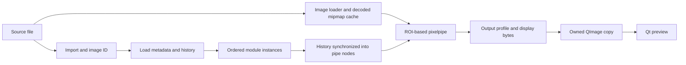

# darktable internals for Omalux

Source audit: 2026-09-08. Main reference: the pinned `release-5.6.1` submodule (`03179f8e080aa9cedebfe14b098b7ba88940a292`). Our installed adapter currently targets 5.6.0; the cache-disabling and OpenCL-error-reset findings below were also checked in its extracted source. Line numbers refer to 5.6.1 unless stated otherwise. Recheck symbols after an upstream update.

This is a source-grounded integration map, not a claim that every module has been audited or that performance parity has been measured. Claude Code was asked for an independent read-only review of parameters, history, color modules and Lua; its findings are reconciled below after checking against source. No engine changes or benchmarks form part of this analysis.

## Read this first

1. **Our current `IMAGE` pipe disables intermediate cache reuse.** Keeping a process/develop context alive still saves initialization and can reuse decoded inputs, but does not currently give Omalux the normal interactive pixelpipe cache behavior.
2. **The three working sliders use a deprecated, display-referred Lab module.** `colisa` is convenient for proving the adapter, not the intended foundation for modern RAW adjustments.
3. **Our GPU warning misses some real fallbacks.** darktable clears `opencl_error` while restarting the pipe on CPU; enabled, running, selected and actually used are different states.
4. **A control is more than a float pointer.** Module instance, type, range, workflow, history, masks, GUI action identity and persistence all matter when extending the registry.
5. **One authoritative develop state remains the right direction.** Keep the second full darktable process as an optional development comparison, not production state ownership.

## Source map

Paths are relative to the darktable submodule.

| Area | Entry points | Why Omalux needs it |
| --- | --- | --- |
| Process startup/shutdown | [`src/common/darktable.c`](../../darktable/src/common/darktable.c): `dt_init`, `dt_cleanup` | Global configuration, databases, modules, caches, OpenCL, signals and lifecycle |
| Develop state | [`src/develop/develop.h`](../../darktable/src/develop/develop.h): `dt_develop_t`, `dt_dev_viewport_t` | Image, module instances, history, viewports and pipe ownership |
| Rendering coordinator | [`src/develop/develop.c`](../../darktable/src/develop/develop.c): `dt_dev_process_image_job` (597), `dt_dev_image` (near 3930) | Input loading, node synchronization, ROI, restart and publication |
| Pixel processing | [`src/develop/pixelpipe_hb.c`](../../darktable/src/develop/pixelpipe_hb.c): `dt_dev_pixelpipe_process` (3147) | Recursive module processing, GPU/CPU, caching and output |
| Cache | [`src/develop/pixelpipe_cache.c`](../../darktable/src/develop/pixelpipe_cache.c): basic hash (103), availability (178) | Reuse is keyed by image, pipe, profiles, upstream state and ROI |
| Module contract | [`src/iop/iop_api.h`](../../darktable/src/iop/iop_api.h), [`src/develop/imageop.h`](../../darktable/src/develop/imageop.h) | Parameters, introspection, processing callbacks, instances |
| Processing order | [`src/common/iop_order.c`](../../darktable/src/common/iop_order.c) | Workflow/image-dependent order, not sidebar order |
| Input/decoder dispatch | [`src/imageio/imageio.c`](../../darktable/src/imageio/imageio.c): `dt_imageio_open` (1626) | Signature dispatch and decoder fallbacks |
| Import and persistence | [`src/common/image.c`](../../darktable/src/common/image.c), [`src/develop/develop.c`](../../darktable/src/develop/develop.c) | Image IDs, sidecars, history and database |
| Input/output color | [`src/iop/colorin.c`](../../darktable/src/iop/colorin.c), [`src/iop/colorout.c`](../../darktable/src/iop/colorout.c), [`src/iop/gamma.c`](../../darktable/src/iop/gamma.c) | Camera/working/display profiles and display byte layout |
| OpenCL | [`src/common/opencl.c`](../../darktable/src/common/opencl.c): `dt_opencl_lock_device` (2041), enabled/running checks (3727) | Device policy and runtime state |
| GTK darkroom | [`src/views/darkroom.c`](../../darktable/src/views/darkroom.c), [`src/bauhaus/bauhaus.c`](../../darktable/src/bauhaus/bauhaus.c) | View scheduling, module widgets and actions |
| Lua bridge | [`src/lua/gui.c`](../../darktable/src/lua/gui.c): `_action_cb` (109), registration (428); [`src/lua/call.c`](../../darktable/src/lua/call.c): GTK wrapper (635) | Safe dispatch of comparison actions to GTK |
| Export | [`src/imageio/imageio.c`](../../darktable/src/imageio/imageio.c): `dt_imageio_export_with_flags` (1045) | Independent full-resolution pipe, output formats and metadata |

## 1. Lifecycle and ownership

`dt_init(..., FALSE, TRUE, ...)` avoids initializing the GTK frontend but does not create a small isolated image-processing object. darktable has a process-global `darktable` state. Startup initializes databases, control infrastructure, profiles, module shared objects and other services. It even allocates `darktable.develop` (`darktable.c:1938`) in addition to the local develop context our adapter creates. Undo setup is gated by `init_gui` (`darktable.c:1758`).

Our actual production-mode prototype is **Qt plus libdarktable in one process, with an Omalux worker thread**. It is not a separately supervised engine process. Split mode adds an independent GTK darktable process. That distinction matters for crash isolation and memory ownership.

The sequence `dt_dev_init(&dev, TRUE); dev.gui_attached = FALSE` initially looks contradictory, but matches upstream `dt_dev_image`: TRUE allocates full/preview/preview2 pipes and histograms (`develop.c:95`); subsequent FALSE suppresses normal GUI behavior. Do not simplify this to `dt_dev_init(FALSE)` while retaining the same full-pipe code: those pipes would not exist. `dt_dev_load_image` also assumes all three exist when full.pipe is present (`develop.c:1000`).

Keep Omalux parameter edits, image switching and rendering serialized on the owning worker. Module/parameter pointers belong to the current develop context and must be rebound after image load, history reload or instance replacement. Stop all consumers before `dt_dev_cleanup`; clear loaded/pointer state after cleanup and cover initialization failures. Upstream cleanup releases pipes, module instances, history, masks and profile data (`develop.c:197`).

## 2. From source file to pixels

`dt_image_import` creates/loads catalogue state; it is not the actual RAW development step. `dt_dev_load_image` loads module instances and history. `dt_dev_process_image_job` obtains decoded pixels through the mipmap cache, with FULL/BLOCKING input when a viewport is provided, and F/BEST_EFFORT for the preview path (`develop.c:630`). Decoding and demosaicing are distinct responsibilities: RAW decoding supplies sensor data; processing modules handle the development operations.

`dt_imageio_open` first uses file-signature dispatch and then fallbacks including RawSpeed, LibRaw and exotic loaders as applicable (`imageio.c:1626`). The wrapper was reviewed here; this is not an audit of the bundled decoders themselves.

The job coordinator owns pipe locking, node creation/synchronization, viewport scale/ROI, restarts and final status. A render job returns `void`. Some early returns retain previously allocated buffers while marking the pipe dirty/invalid. Therefore our current test of only non-null backbuf and positive dimensions is insufficient to prove a fresh successful render. Require valid status and an output identity/revision contract before publishing a frame.

## 3. Performance: the current cache gap

Confirmed call chain:

- Omalux sets `dev.full.pipe->type |= DT_DEV_PIXELPIPE_IMAGE` in `native/engine.c`.
- `dt_dev_pixelpipe_process` sets `pipe->nocache = dt_pipe_is_image(pipe)` (`pixelpipe_hb.c:3157`; 5.6.0:3064).
- Recursive processing only uses cached results when `!pipe->nocache` (`pixelpipe_hb.c:1827`). Cache availability independently rejects nocache (`pixelpipe_cache.c:178`).

The flag came from the upstream helper for producing an image, not from a guarantee of optimal persistent interactive rendering. Our warm-process advantage and decoded-input cache remain distinct from intermediate stage reuse. Correct the assumption that keeping pipe allocations alive automatically means earlier stages are reused.

A future change should establish a persistent interactive pipe configuration with valid invalidation and lifecycle behavior. Do not blindly delete one flag: image/full flags also influence other processing choices. Trace all flag uses and compare cached and uncached output before adopting it.

Cache hashes include image identity, pipe mode, profiles, upstream piece hashes and ROI (`pixelpipe_cache.c:103`). Keep those invariants intact. Avoid changing untouched modules or flushing everything for every slider. Our generic engine currently adds history for every registered module on every render. With all three controls in colisa this is one module; after adding controls across modules it can create redundant alternating history entries and unnecessary synchronization.

The native worker coalesces queued snapshots and discards obsolete completed frames. It does **not** cancel the in-flight expensive render. On large RAWs that can still delay the newest result. Study the shutdown/restart protocol and history locking before introducing cancellation; never mutate parameters from the Qt thread while nodes consume them.

Measure end-to-end input-to-displayed-frame latency, warm p50/p95, cache hits, cold start, CPU/GPU paths and memory. Use large RAWs and late versus early pipeline controls. The beach JPEG is useful for a smoke check, not performance or RAW fidelity evidence. Test Omalux alone as well as split mode: both processes compete for resources.

## 4. Parameters, instances and history

A module shared object describes an operation; a `dt_iop_module_t` is a develop-context instance; pipe nodes hold committed processing state. `params` is editable state, not a universal instruction to redraw. `get_p` provides a field address, while `get_f` and the introspection metadata supply field type/range (`iop_api.h:314`, `common/introspection.h:57`).

Our registry only supports known floats and an affine UI-to-parameter transform. Before widening it:

- Validate introspection presence, field type, range and transformed bounds; fail with the control ID rather than casting arbitrary fields to `float *`.
- Identify a specific module instance, not merely the first operation-name match. `multi_priority`, operation and module order are part of identity.
- Read loaded values/enabled state into UI. We currently write registry defaults on first render, overwriting imported values for these parameters and enabling their module.
- Separate native parameter identity from the GTK action path. Widget labels/sections may differ from C field names. `iop/module/parameter` works for colisa but is not a universal action naming rule.
- Keep complete snapshots to avoid losing edits when coalescing. Track dirty modules within the worker for history/synchronization efficiency.

`dt_dev_add_history_item_ext` updates module history and marks pipes for SYNCH or TOP_CHANGED (`develop.c:1180–1349`). The regular GUI wrapper adds undo grouping, timestamps/tags, invalidation and signals and exits early when `darktable.gui` is absent (`develop.c:1371`). The ext call is appropriate for our current controlled headless path, but is not equivalent to a complete user edit transaction.

Repeated changes to the same top history item can merge. History is the processing recipe; it is not automatically a complete UI undo stack. Reset-all currently means writing registry defaults and enabling the controlled modules, not restoring the image's imported recipe. Specify separate semantics for reset control, reset image and undo.

Masks and blending have their own history/state. Multi-instance modules, forms and raster-mask dependencies need deliberate support; copying just numeric slider values is insufficient.

## 5. Color and camera profiles

The pipeline does not have one universal color space or a fixed order matching our sidebar. Use the workflow and order stored with the image (`common/iop_order.c`), and let modules declare input/output spaces and ROI transforms. RGB RAW and JPEG workflows differ.

`colorin.reload_defaults` selects profiles from image metadata and capabilities. Its fallback chain includes embedded profiles, recognized image color spaces, embedded matrices and supported camera matrices (`colorin.c:1892`). Users normally need not choose their camera manually. This source finding does not imply Adobe DCP look-table compatibility or Lightroom preset equivalence.

Our `colisa` module explicitly advertises non-linear Lab/display-referred processing and deprecation (`colisa.c:74–108`); upstream points to color balance RGB. For the next deliberate UI mapping, investigate:

| UI intent | Candidate module/parameter | Caveat |
| --- | --- | --- |
| Exposure in EV | `exposure.exposure` | Not the same operation or unit as colisa brightness |
| Scene grading contrast | `colorbalancergb.contrast` | Has a contrast fulcrum and different visual behavior |
| Saturation/colorfulness | `colorbalancergb.saturation_global` or `chroma_global` | Perceptual saturation and chroma are different controls; choose by image tests |
| Scene-to-display tone mapping | Workflow-selected `filmicrgb`, `sigmoid` or `agx` | Do not enable all or treat them as interchangeable presets |

These are source-derived candidates, not drop-in replacements with identical results. Preserve imported workflows and test RAW highlights, skin, saturated colors and monochrome images.

`colorout.commit_params` chooses output profiles by pipe purpose: export overrides, thumbnail colorspace, second-display profile, or main display profile (`colorout.c:554–619`). Omalux must explicitly own the display color contract, including monitor changes and any Qt/compositor transform. The current untagged QImage route does not establish color parity with the GTK window merely because both use darktable.

The `gamma` display module's normal `_copy_output` writes BGR channels and leaves the fourth byte untouched (`gamma.c:265`). Our alpha fill is required for QImage RGB32 on the current platform. Retain it; do not infer transparency from the unused byte or use this 8-bit display buffer as the export source.

## 6. GPU status and failure semantics

`dt_opencl_is_enabled` only checks initialized plus enabled (`opencl.c:3727`). Runtime state is exposed separately by `dt_opencl_running`; device selection depends on pipe class and configured priorities (`opencl.c:2041`). Individual modules may process on CPU, GPU or tiled paths.

On OpenCL failure, the pixelpipe releases resources, sets `opencl_enabled = FALSE`, **clears `opencl_error`**, increments the global error counter and restarts on CPU (`pixelpipe_hb.c:3243–3284`). It can eventually stop OpenCL for the session. The normal completion path also resets `pipe->devid` to CPU after releasing the device (`3294`), so reading the final device ID is not a reliable replacement.

Our warning should distinguish configuration unavailable, runtime stopped, per-render fallback and normal mixed processing. A narrow telemetry hook or an adapter-visible render result is preferable to guessing from transient flags. This audit confirms a reporting gap, not a new failure of the user's GPU.

## 7. Split-mode comparison

The private atomic mailbox transports a complete latest control state; Lua polls every 50 ms. `dt.gui.action` is explicitly GTK-wrapped (`lua/gui.c:428`); the wrapper dispatches through GLib and waits for completion (`lua/call.c:648`). This is preferable to writing GTK module structures from the polling thread. Omalux itself does not wait for the second process.

However, several GUI actions are separate edit operations, not one atomic multi-module transaction. Intermediate comparison frames may appear. The two instances also have independent module state, histories, caches and display configuration. Do not call this a pixel-equality validator.

Before more complex comparisons, align workflow, module instance, enabled state, profiles, processing resolution and source history. Confirm image identity before applying commands; our current bridge checks darkroom view but does not stop edits being applied to a different image opened in that window. Add an acknowledgement/revision for stale or failed comparison state if it is used for validation. Native parameter names and GUI action paths must be modeled separately when they diverge.

## 8. Saving, sidecars and export

Image identity, metadata, processing history, presets/styles and user configuration are separate persistent concerns. Startup/history loading can apply defaults and matching auto-presets (`develop.c:1856`, `2301`). Existing XMP sidecars may be read during import (`common/image.c:1794`, `2050`); `write_sidecar_files=never` prevents writes, not reads.

`dt_dev_write_history_ext` writes develop history to the image's database state (`develop.c:1769`); wrapper behavior and sidecar policy must be understood before adding Save. Our temporary databases and initial registry defaults are prototype behavior, not a persistence design.

`dt_imageio_export_with_flags` creates its own develop context, loads image/history and initializes an export pipe (`imageio.c:1045–1127`). A future export based only on image ID can miss our unsaved in-memory edits. First snapshot/persist the intended processing recipe into a controlled context, then use the export pipeline with explicit profile, dimensions, format, bit depth and metadata policy. Do not save the QImage preview as the developed original.

## 9. Recommended implementation order

1. Define structured render results: revision/image identity, valid/failed/cancelled status, dimensions, output color contract and GPU telemetry.
2. Establish interactive caching and dirty-module tracking, validated against the existing rendering path before benchmarking.
3. Harden control resolution: introspection types, explicit instances, imported state, action paths and reset semantics.
4. Introduce deliberate scene-referred controls while preserving stored workflows.
5. Add viewport/zoom and image-switch lifetime handling; implement cancellation only with a verified locking contract.
6. Add persistent history/undo and export from the same authoritative recipe.
7. Extend comparison to acknowledge recipes and use reference images under controlled color/scale settings.

Keep the official submodule unchanged while this can be done in the adapter. If a real missing hook requires source changes, keep a small versioned overlay with a clear invariant and upstream rationale. Do not claim the installed libdarktable is a stable SDK: patch releases here already change pixelpipe/cache structures. The current exact-header check is necessary but does not by itself validate distributor patches, plugin ABI or behavior changes.

## Verification still needed

This source audit does not settle monitor color management on this Wayland/Qt setup, performance parity, cancellation races, complex imported XMP/masks, export equivalence or decoder support across cameras. Those need focused runtime experiments and representative RAW files. Revisit this document after each implementation change; it describes the adapter at commit `30f421a`, not a completed application.
